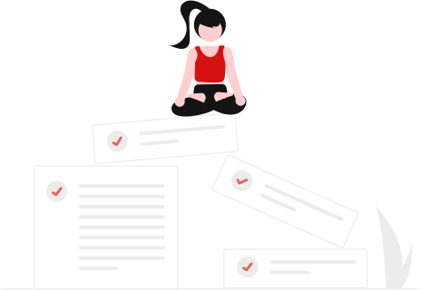
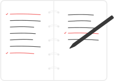

# Практическая работа №5
## Тема: Верстка по макету Figma.

```html
<!DOCTYPE html>
<html lang="ru">
    <head>
        <title>Taskana App</title>
        <link rel="stylesheet" href="assets/reset.css">
        <link rel="stylesheet" href="assets/variables.css">
        <link rel="stylesheet" href="assets/global.css">
    </head>
    <body>
        <header class="start">
            <div class="logo">taskana</div><div class="square"></div>
            <button class="but">Создать</button>
        </header>
        <div class="blocks">
        <aside>
            <button class="incoming">Входящие</button>
        </aside>
        <main>
            <div class="container">
            <div class="h_main">Входящие</div>
            <div class="main">
                <div class="texts">
                    <h2 class="tasks">Все твои задачи организованы как надо</h2>
                        <p class="work">Отличная работа! Ты большой молодец!</p>
                </div>
                            
            </div>
            </div>
            <footer>
                <p class="foot">Проект выполнен в рамках стажировки <u>PREAX</u></p>
            </footer>
            </main>
        <sidebar>
            <div class="s_cont">
                
                <p class="help">Здесь мы поможем тебе управлять твоими задачами, отслеживать статистику и самочувствие</p>
            </div>
        </sidebar>
        </div>
    </body>
</html>
```

## Global css:

```css
html, body {
    height: 100%;
}

body {
    display: flex;
    flex-direction: column;
    height: 100vh;
    overflow: hidden;
}

.start {
    display: flex;
    height: 64px;
    color: white;
    background-color: var(--base);
    flex-shrink: 0;
}

.logo {
    padding: 12px 0 12px 28px;
    height: 40px;
    width: 126px;
    font-size: 40px;
    z-index: 1;
}

.square {
    margin: 16px 0 16px -110px;
    height: 40px;
    width: 40px;
    background: linear-gradient(to bottom, var(--primary-400), var(--primary-500));
    border-radius: 8px;
}

.but {
    display: flex;
    justify-content: flex-end;
    margin: 12px 16px 12px auto;
    padding: 8px 16px 8px 12px;
    font-size: 16px;
    color: var(--neutral-0);
    height: 40px;
    width: 118px;
    border: none;
    border-radius: 8px;
    gap: 8px;
    background-color: var(--primary-400);
}

.plus {
    height: 24px;
    width: 24px;
    filter: brightness(0) invert(1);
    margin-top: -3px;
}

.blocks {
    display: flex;
    flex-direction: row;
    flex: 1;
    min-height: 0;
}

aside {
    flex: 0 0 204px;
    background-color: var(--neutral-100);
    border-right: 1px solid var(--neutral-300);
    display: flex;
    flex-direction: column;
}

.incoming {
    height: 40px;
    width: 172px;
    margin: 24px 16px auto 16px;
    border-radius: 8px;
    border: none;
    color: white;
    background-color: var(--neutral-800);
    display: flex;
    align-items: center;
    gap: 8px;
}

.inbox {
    height: 24px;
    width: 24px;
    filter: brightness(0) invert(1);
}

main {
    flex: 1;
    display: flex;
    flex-direction: column;
    background-color: var(--neutral-0);
    min-height: 0;
}

.container {
    flex: 1;
    display: flex;
    flex-direction: column;
    padding: 0 24px;
    overflow-y: auto;
}

.h_main {
    padding: 24px 0;
    font-weight: bold;
    font-size: 32px;
    align-self: flex-start;
    line-height: 40px;
}

.main {
    display: flex;
    flex-direction: column;
    align-items: center;
    flex: 1;
    justify-content: center;
    gap: 24px;
}

.texts {
    display: flex;
    flex-direction: column;
    justify-content: center;
    align-items: center;
    gap: 24px;
    text-align: center;
}

.tasks {
    margin: 0;
    line-height: 32px;
}

.work {
    margin: 0;
    line-height: 24px;
}

.sit {
    height: 319px;
    width: 463px;
    max-width: 100%;
    height: auto;
}

footer {
    flex-shrink: 0;
    height: 56px;
    display: flex;
    align-items: center;
    justify-content: center;
    background-color: var(--neutral-0);
    border-top: 1px solid var(--neutral-200);
}

.foot {
    margin: 0;
    color: var(--neutral-600);
    line-height: 24px;
}

sidebar {
    display: flex;
    flex-direction: column;
    justify-content: center;
    align-items: center;
    flex: 0 0 400px;
    border-left: 1px solid var(--neutral-300);
    background-color: var(--neutral-100);
    padding: 24px;
    gap: 24px;
}

.s_cont {
    display: flex;
    flex-direction: column;
    justify-content: center;
    align-items: center;
}

.note {
    height: 231px;
    width: 168px;
}

.help {
    text-align: center;
    font-size: 16px;
    line-height: 24px;
    text-align: center;
    max-width: 300px;
    color: var(--neutral-800);
}
```

## Reset css:

```css
* {
    margin: 0;
    padding: 0;
    box-sizing: border-box;
}
```

## Variables css:

```css
:root {
    --neutral-0: #FFFFFF;
    --neutral-100: #FBFBFB;
    --neutral-200: #F3F3F3;
    --neutral-300: #ECECEC;
    --neutral-400: #BFBFBF;
    --neutral-500: #8C8C8C;
    --neutral-600: #6C6C6C;
    --neutral-700: #393939;
    --neutral-800: #1C1C1C;
    --neutral-900: #141414;
    --primary-0: #FFF4F4;
    --primary-100: #FFCECE;
    --primary-200: #FCA9A9;
    --primary-300: #F25959;
    --primary-400: #D51010;
    --primary-500: #A60C0C;
    --primary-600: #760909;
    --base: #000000;
}
```